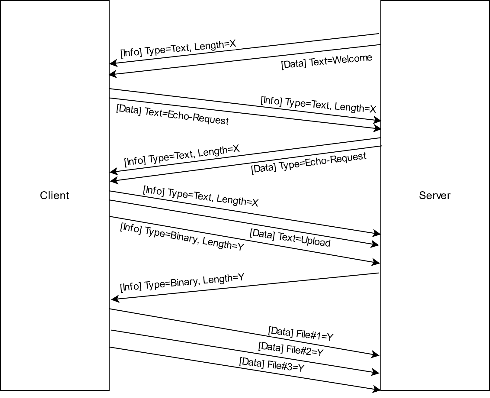

# SocketFileServer
A simple file transfer client / server based on raw socket. Using multi-threading technology, one server supports multiple clients. It supports large files transport by multiple segments, and provide friendly error message.

## Command

- **echo**:  request server echo response 
- **list**:  lists the files on the server 
- **download**:  Download server file from 
- **upload**:  upload files from the client to the server 
- **exit**:  to exit the client 

## Requirement

- CMake >= 3.19
- MSVC 2019 (WIN32 API)

*Lower version of the compiler and cmake SHOULD be supported, please modify `CMakeList.txt` and test it yourself.* 

## Protocol

## Usage

Edit the bound IP address and port number in `common.h` and the use cmake to compiler.

## License

MIT License

**Copyright (c) 2021 ColorsWind**

Permission is hereby granted, free of charge, to any person obtaining a copy
of this software and associated documentation files (the "Software"), to deal
in the Software without restriction, including without limitation the rights
to use, copy, modify, merge, publish, distribute, sublicense, and/or sell
copies of the Software, and to permit persons to whom the Software is
furnished to do so, subject to the following conditions:

The above copyright notice and this permission notice shall be included in all
copies or substantial portions of the Software.

THE SOFTWARE IS PROVIDED "AS IS", WITHOUT WARRANTY OF ANY KIND, EXPRESS OR
IMPLIED, INCLUDING BUT NOT LIMITED TO THE WARRANTIES OF MERCHANTABILITY,
FITNESS FOR A PARTICULAR PURPOSE AND NONINFRINGEMENT. IN NO EVENT SHALL THE
AUTHORS OR COPYRIGHT HOLDERS BE LIABLE FOR ANY CLAIM, DAMAGES OR OTHER
LIABILITY, WHETHER IN AN ACTION OF CONTRACT, TORT OR OTHERWISE, ARISING FROM,
OUT OF OR IN CONNECTION WITH THE SOFTWARE OR THE USE OR OTHER DEALINGS IN THE
SOFTWARE.
